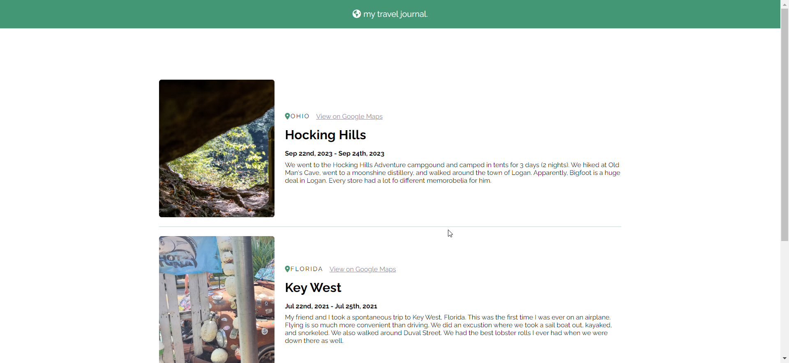

# Solo 03 - Travel Journal

This was the third solo project of the course. For this one, it is a simple travel journal of some places I have visited. I have used my own travel experiences to populate the project.

    

## Some things to consider

- This is my own travel information.
- This is **not** responsive. The goal of this project is to use react, not to make a responsive website.
- I am pulling the data from a `data.js` file.
- I use `.map()` to display the cards for each travel entry.
- I did use a CSS variable for the color. That way, if I wanted to hot swap out different colors for different themes, I could.
- This design is not mine. The course provided a figma file of a basic design. I adapted my project off of the base design of that. I did take some creative liberties in usin my preferred font and colors to match my personal branding.

## React + Vite

This template provides a minimal setup to get React working in Vite with HMR and some ESLint rules.

Currently, two official plugins are available:

- [@vitejs/plugin-react](https://github.com/vitejs/vite-plugin-react/blob/main/packages/plugin-react/README.md) uses [Babel](https://babeljs.io/) for Fast Refresh
- [@vitejs/plugin-react-swc](https://github.com/vitejs/vite-plugin-react-swc) uses [SWC](https://swc.rs/) for Fast Refresh
